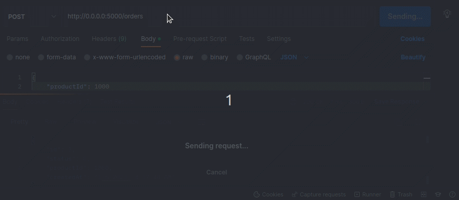
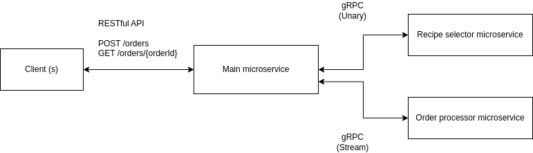

# node-grpc-demo
Implementing an inter-microservice communication system with Node gRPC



## How to run this project?

Clone or download the repository. Install dependencies:

```bash
npm install
# --- or ---
yarn install
```

Start microservices:
```bash
npm start
# --- or ---
yarn start
```

The above command will start three microservices. You can communicate with the primary microservice with the following RESTful endpoints:

- `POST /orders`
- `GET /orders/{orderId}`

## Project architecture



Design credits: [diagrams.net](https://diagrams.net)

## License
[MIT](LICENSE)
